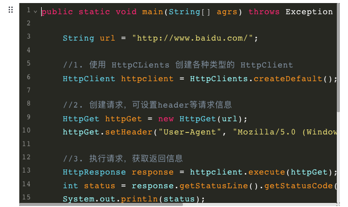

# Code
Code Tool for Editor.js 2.0. power by codemirror.



## Feature
+ [x] line number ✌️
+ [x] code folder ✌️
+ [x] theme selector ✌️
+ [x] language selector ✌️
+ [x] copy ✌️
+ [x] tab/shift+tab support ✌️

## Usage

Add a new Tool to the `tools` property of the Editor.js initial config.

```
npm i @7polo/editorjs-code2
```

```javascript
var editor = EditorJS({
  ...
  tools: {
    ...
    code: {
        class: Code,
        config: {
            defaultTheme: 'okaidia',
            defaultLanguage: 'java'
        }
    }
  }
});
```

## Output data

This Tool returns code.

```json
{
    "type" : "code",
    "data" : {
        "code": "body {\n font-size: 14px;\n line-height: 16px;\n}",
        "language": "css",
        "theme": "tomorrow"
    }
}
```


